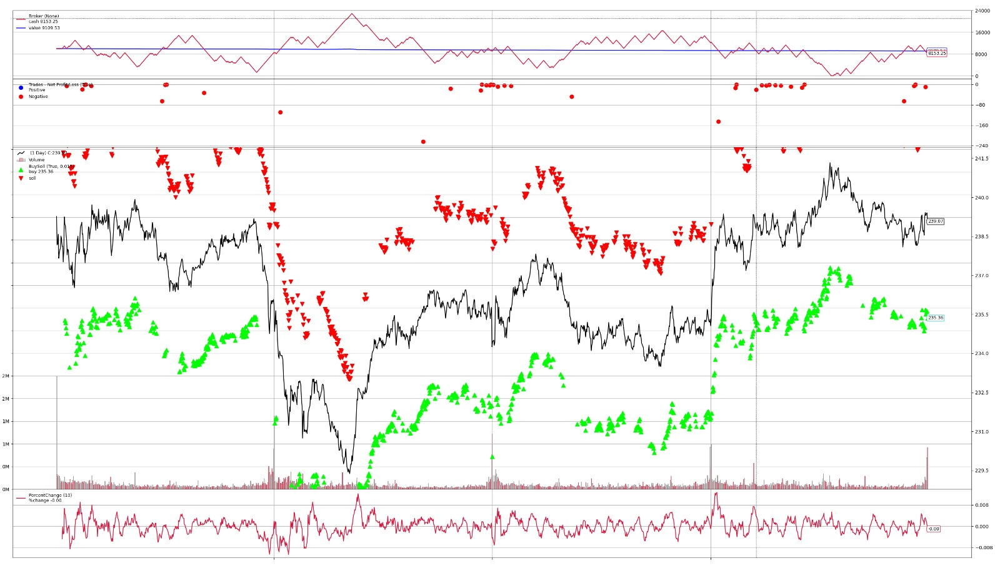

# Algorithmic-Trading-Code
# Algorithmic Trading Platform

A Python-based platform for high-frequency trading analysis, designed to stream real-time stock data, analyze trends, and generate trading strategies for research purposes. **Not intended for production trading or actual purchases**—this is an experimental tool for exploring quantitative trading concepts.

## Overview
This project simulates an algorithmic trading environment, integrating real-time data from Alpaca API, historical data via yfinance, and a time-series database (InfluxDB). It implements Momentum, Mean-Reversion, and Arbitrage strategies, visualizes signals with Dash, and backtests performance using Backtrader. The setup is containerized with Docker for portability and scalability.

### Features
- **Real-Time Data**: Streams 1-minute stock bars (e.g., AAPL, SPY) using Alpaca API.
- **Trend Analysis**: Generates signals with three strategies:
  - *Momentum*: Based on price change thresholds.
  - *Mean-Reversion*: Using Simple Moving Averages (SMA).
  - *Arbitrage*: Analyzing price spreads between tickers.
- **Visualization**: Interactive Dash dashboard (`http://localhost:8050`) with price trends and signals.
- **Backtesting**: Simulates strategies on 5-day historical data,  yielding $9109.53 from $10,000 (Momentum strategy).
- **Data Storage**: InfluxDB for efficient time-series management.
- **Dockerized**: Runs via Docker Compose with `app` and `influxdb` services.

### Sample Backtest Plot

*Caption*: Backtest of Momentum strategy on AAPL (5 days, 1-min intervals), showing price trends and trades, ending with $9109.53 from $10,000.

---

## Technologies
- **Python 3.12**: Core language for scripting and logic.
- **Alpaca-py (0.39.0)**: Real-time stock data streaming.
- **InfluxDB (2.7)**: Time-series database with Flux queries.
- **Backtrader (1.9.78.123)**: Backtesting framework.
- **Dash (2.18.2) & Plotly (6.0.0)**: Interactive visualization.
- **Pandas (2.2.3) & NumPy (2.2.3)**: Data analysis and computation.
- **Yfinance (0.2.54)**: Historical data retrieval.
- **Matplotlib (3.10.1)**: Static plot generation.
- **Docker & Docker Compose**: Containerization and orchestration.

## Skills Demonstrated
- Python programming and asynchronous coding (`asyncio`).
- Algorithmic trading strategy design and backtesting.
- Quantitative analysis of financial data.
- Real-time data pipelines and time-series management.
- Data visualization (Dash, Matplotlib).
- Containerization and DevOps (Docker setup, networking).
- Troubleshooting (e.g., port conflicts, InfluxDB authentication).
- Linux command-line proficiency (Bash).

---

## Prerequisites
- **Python 3.12**: Installed locally for non-Docker runs.
- **Docker**: For containerized setup (Docker Desktop or CLI).
- **InfluxDB Token**: Generated from InfluxDB UI or pre-set.
- **Alpaca API Keys**: Free-tier keys from [Alpaca](https://alpaca.markets/).

---

## Setup Instructions

### Local Run (Python)
1. Clone the repository:
   ```bash
   git clone https://github.com/yourusername/algorithmic-trading-code.git
   cd algorithmic-trading-code

   
